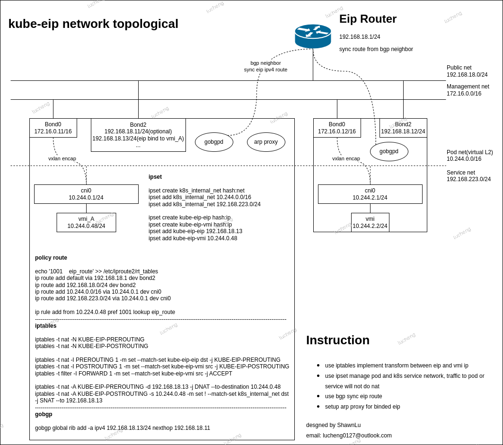

# kube-eip

[中文](./docs/README_zh.md)

**Kube-eip** is an elastic ip management add-on for kubevirt. The aim is to provide an access to kubevirt vmi through elastic ip.

## Architecture



At it's core, kube-eip use the rules of iptables implement the transform between eip and vm instance ip. By default we access the pod and service network via vmi pod ip, others by eip, if make a eipBinding to a vmi pod. For convenience we use ipset to manage the networks of pods and service, and alse this's a policy route for each eipBinding, make sure that we connect to other pods with vmi pod ip.

Then for eip routes, we use bgp to declare that the nexthop to access vmi pod that binded eip. There ware a series bgp server we can choise, but we can use gobgp as the bgp library native.

## Lifecycle of eip

Kube-eip extends kubeernets by adding a eipBinding CRD. An eipBinding represent a eip binded to a vmi pod. And an eip can be create and bind or destoryed along with the eipBinding. Also operator will watch EipBinding and kubevirt VirtualMachineInstance, and handle create update and delete event.

## Modules

There are two compose Operator and EipAgent. Operator watch the EipBinding and VirtualMachineInstance create, update and delete event. Then call EipAgent to build the rules on hyper, via grpc.

## Usage

**operator**

build operator images and deploy

```
# Build images
IMG=quay.io/shawnlu0127/eipbinding_operator:20231128 make docker-build-operator

# Push images
IMG=quay.io/shawnlu0127/eipbinding_operator:20231128 make docker-push

# Deploy operator with images
IMG=quay.io/shawnlu0127/eipbinding_operator:20231128 make deploy
```

**eip_agent** run as daemonset

build eip_agent images and push

```
IMG=quay.io/shawnlu0127/eip_agent:20231128 make docker-build-agent
IMG=quay.io/shawnlu0127/eip_agent:20231128 make docker-push
```

```
root@shawn-server:~/workspace/kube-eip/cmd/eip_agent# ./eip_agent -h
NAME:
   EipAgent - A new cli application

USAGE:
   EipAgent [global options] command [command options] [arguments...]

COMMANDS:
   help, h  Shows a list of commands or help for one command

GLOBAL OPTIONS:
   --port value                                   agent port that rpc listen on (default: 6127)
   --log-level value                              log level, default info (default: "info")
   --internal-net value [ --internal-net value ]  networks that exclude from nat
   --gateway-ip value                             externel network gateway ip address
   --gateway-dev value                            externel network gateway device
   --bgp-type value                               bgp manager type, default is none, gobgp is avaliable (default: "none")
   --eip-cidr value                               eip network cidr
   --help, -h                                     show help
```

**eipctl** a command line tool to bind and unbind eip to vmi

```
root@shawn-server:~# ./eipctl -h
NAME:
   eipctl - A new cli application

USAGE:
   eipctl [global options] command [command options] [arguments...]

COMMANDS:
   help, h  Shows a list of commands or help for one command

GLOBAL OPTIONS:
   --target value  rpc server address, default 127.0.0.1:6127 (default: "127.0.0.1:6127")
   --eip-ip value  eip ip address
   --vmi-ip value  vmi ip address
   --action value  action, bind or unbind
   --help, -h      show help
```
